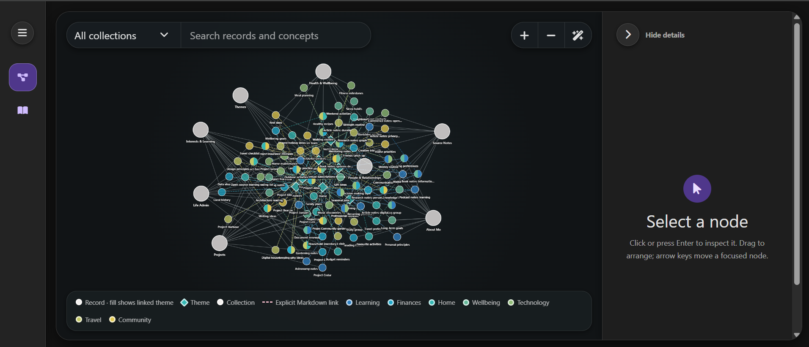
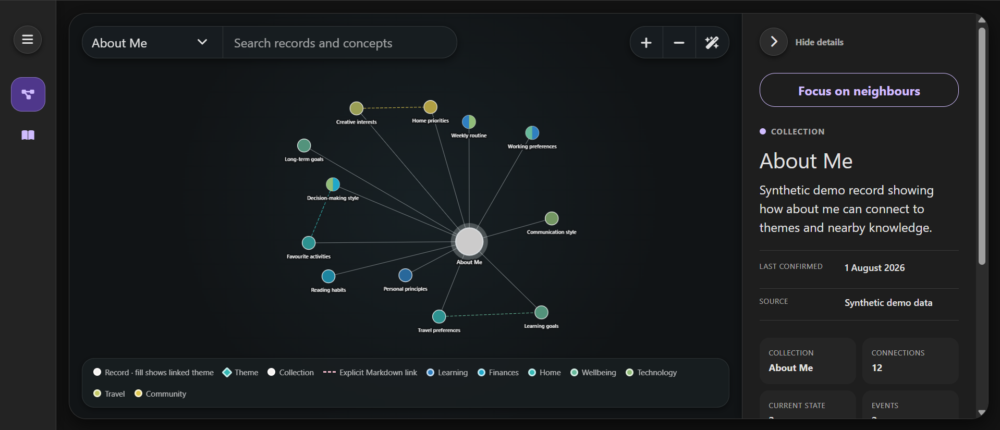
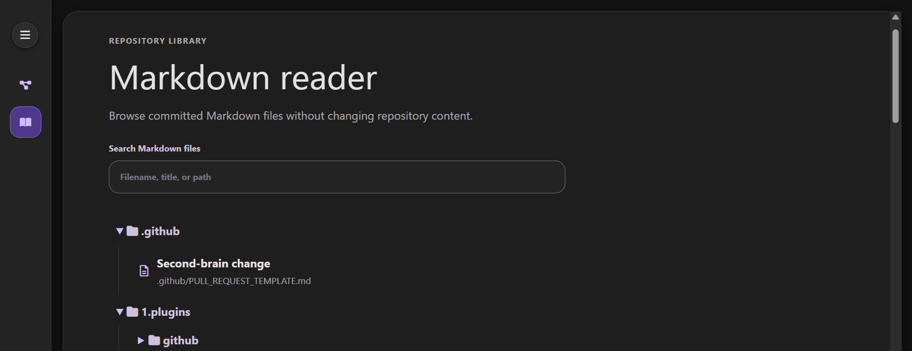

# Browser explorer

A provider-neutral, optional Next.js explorer for reading committed Markdown and visualising Core records. Cytoscape.js supplies the knowledge graph while the shared application menu also provides a repository-wide Markdown reader. The interface reads generated JSON and repository files and never writes to them.

## Prerequisites

Install these before running the website locally:

- **Node.js 22.13.0 or later**: required by the application. Installing Node.js normally also installs npm.
- **npm**: used to install dependencies and run the supplied commands.
- **Git**: required by the normal data builder to discover the Markdown files committed to the second-brain repository.
- **A modern web browser**: for example Chrome, Edge, Firefox or Safari.

Python 3 is also required if you run `npm run brain:check`, because that validation command runs the Core repository checker. It is not required simply to start the demo website.

You can confirm the main command-line prerequisites with:

```bash
node --version
npm --version
git --version
```

Run all npm commands below from the `3.add-ons/browser-explorer/` directory.

## Local use

```bash
npm ci
npm run brain:check
npm run dev
```

The data builder writes schema version 5 of `public/brain-data.json`. Its `graph` property retains the curated Core-only graph semantics; its `markdown.files` index lists every committed repository `.md` file with a title, filename, normalized repository-relative path, and folder segments. Generated, dependency, and VCS directories are excluded. Graph connections represent only explicit Markdown links and collection membership. Theme membership is exposed only when a record and a Core theme contain reciprocal Markdown links, so the visualisation does not infer or invent relationships.

## Screenshots

The web browser add-on allows you to visualise the contents of your second brain using a knowledge graph, powered by Cytoscape.js.



Using the application, you can filter the graph using specific collections of interest, or apply universal searches for matching topics.



You can also explore the contents of the second brain using a Markdown file viewer, optimised for the structure of records held in the second brain.



## Demo mode

A new installation can run the explorer without adding any real knowledge:

```bash
npm ci
npm run demo
```

`npm run demo` generates `public/demo-brain-data.json` and launches the development server configured to use a synthetic graph instead of the normal Core-derived graph. The demo graph is deterministic and contains exactly 100 synthetic nodes across example collections and seven themes, including cross-theme records and enough relationships to demonstrate filtering, selection, neighbourhood exploration, automatic layout, dragging, zooming and theme colouring.

Demo mode changes only the graph data. The application remains read-only, so the normal repository Markdown index is retained and the Markdown reader can still browse Core and the rest of the committed repository. Synthetic graph records deliberately have no repository file paths, so selecting a synthetic node does not pretend that a matching real record exists.

Running `npm run demo` also rebuilds the normal read-only Markdown index before creating the demo data. Neither generated JSON file is committed to Git. Running `npm run dev` afterwards returns the graph to the repository's actual Core content. `npm run demo:build` can be used when only the synthetic graph data and repository Markdown index need to be regenerated without starting the application.

The architectural `2.core/memory/core.md` record is intentionally omitted from the normal graph. Selecting any other normal node lists its own and its directly connected Markdown files in the detail panel. The Markdown reader offers a searchable folder tree for the complete index. Files open as read-only, app-styled pages while the shared menu remains available.

When a graph has no saved positions, Cytoscape automatically arranges the visible nodes with extra room for record labels and fits them in the viewport. Node coordinates stay in that browser's local storage, so returning to the graph restores the saved arrangement instead of running the automatic layout again. Drag nodes to place them manually; nodes remain keyboard-selectable and focused nodes can also be moved with the arrow keys (or Shift + arrow for a larger step). Both forms of manual movement save the new coordinate.

**Arrange graph** runs the automatic layout over the currently visible nodes, fits them in the viewport, and saves the result; choosing it may replace coordinates created by manual dragging for those nodes. **Reset layout** first clears every saved coordinate, then automatically arranges and fits the visible nodes and saves the resulting stable positions. Filtering before either action limits the arrangement and fit to visible nodes. Scroll a mouse wheel or use a trackpad over the canvas to zoom around the pointer.

Hosting, authentication and deployment adapters are deliberately absent. Add any provider-specific integration under `1.plugins/` while keeping this add-on unchanged.
